```{=html}
<script>
document.addEventListener("DOMContentLoaded", function () {
  var target = "#overview";
  if (window.location.hash !== target) {
    window.location.hash = target;
  }
});
</script>
```

# Overview


**Computational Musicology Portfolio Overview**


**Introduction**


Research Question: How does the selected corpus, “Basspunk” (2024) by
Bassvictim align with the existing genre boundaries of “Unknown
Pleasures” (1979) by Joy Division?

**Corpus Context and Goal**


The corpus selected consists of tracks within the album, “*Basspunk*”
(2024) by Bassvictim, a contemporary band whose work fuses alternative
indie, hyper-pop, gritty electro-pop and EDM. The Band Joy Division, and
especially their album, “*Unknown Pleasures*” (1979) has influenced
Bassvictims unique sound, with a significant influence on the use of
bass and the ‘*post punk*’ genre that Joy Division helped fortify back
in the late 1970’s - 1980’s. The typical genre conventions of ‘post
punk’ include low valence, with an overall mesto tone, tempo tends to be
fast and intense, with a constant rhythm, averaging the energy levels as
high. This portfolio will examine how these features will differ between
the two albums and their respectful artists. The intention of this
project is to investigate whether Spotify audio features reflect a clear
genre alignment or reveal a hybridization that defies the conventional
classification that Bassvictim is assumed to be categorized in. In order
to achieve this goal, there will be an exploration into many different
computational musicological models for music information retrieval and
analysis.

**Provisional Hypothesis**


Given the hybrid nature of Bassvictim’s genre classification, it is
predicted that musical features such as timbre and valence will
demonstrate less structurally dynamic alignment with the established
genre boundaries of post punk.

**Conclusion**


This project has used computational musicology methods to explore how Basspunk (2024) by Bassvictim aligns, and departs, from the genre foundations set by Joy Division’s Unknown Pleasures (1979). Through analyses of harmonic, timbral, rhythmic, and structural features, the findings consistently show that while Bassvictim inherits the affective and aesthetic core of post punk, their musical identity diverges through digital excess, timbral density, and rhythmic instability. The computational evidence, from chromagrams and MFCCs to novelty curves and hierarchical clustering, highlights a clear evolution: where Unknown Pleasures is cohesive, minimalist, and thematically unified, Basspunk is intentionally hybrid, merging post‑punk’s low‑valence emotionality with hyperpop and EDM’s intensity and textural experimentation.
In broader terms, this research demonstrates the value of using computational analysis as a complement, revealing nuanced continuities and fractures that might otherwise remain implicit. It offers a framework for tracking how genre conventions mutate over time through digital production, sampling, and hybridization.
Future work could expand this by examining listener perception data alongside these computational models, incorporating sentiment or lyrical analysis, or broadening the corpus to include other post punk revival and electronic cross‑genre artists. Doing so would help map the ongoing evolution of post‑punk aesthetics in a digital context, showing how technological mediation pushes genre beyond its original sonic and emotional frontiers.
Ultimately, this study contributes to a growing understanding of how genre operates as a dynamic continuum, reflecting wider cultural and technological shifts in 21st century music production and identity.

**Personal Reflection** 

This project required a lot of new skills and an entirely new field that I was completely new to, it was very challenging to learn how to code and organise all the new concepts, but it was an incredibly enriching experience. Throughout the course I started to become more confident in my coding abilities, and as reflected in the portfolio, a lot of improvements were made in terms of being more intentional in the analyses, with emphasis on specific songs rather than an overview of the albums as a whole. In the future, I am very curious and excited to see where these skills will push me to grow. 


# Personal Portfolio

## Analysis Views {.tabset style="color: Black"}

### Chapter I.

::: {style="display: flex; gap: 25px;"}
**Week 7 - Audio Visualizations**

Bassvictim - Basspunk (2024) Basspunk Histogram


Description: 

The histogram demonstrates the Spotify audio features
energy and count for the Basspunk tracks. On the x-axis, the energy
represents how fast, loud and noisy the track feels, with values ranging
from 0.0 -1.0, with higher values indicating more energy produced. The
y-axis represents the count, ranging from 0-4 on this graph, and
indicates the frequency of a specific energy value occurring. The taller
the measure, the more time the song spends at that specific energy
level.

Interpretation 

The histogram shows that the energy level 0.55-0.75 was
most consistently produced throughout the album at the count of 2,
however the energy level 0.85-0.95 reached the highest counted measure
of 4, positing this energy level as the highest measured frequency value
spent throughout the album.

Analysis 

The skew in a higher energy level spent at the longest measured
frequency on this histogram indicated that the album aligns with the
typical genre norms of electronic and hyper-pop intensity.

Evaluation 

The histogram helps to specifically visualise the energy
level and the frequency at which it is measured, making it a helpful
tool in musical comparison. The advantages of analysing the entire
album’s recorded energy levels through this histogram allows for a
general overview of information, however a strong limitation is that
there was no exploration into multiple histograms of different songs
from the same album. For future research, exploration into more tracks
from the corpus would be greatly beneficial. Furthermore, it is
difficult to visualise a musical comparison through one histogram alone,
meaning multiple are required for a stronger analysis.

Basspunk Scatterplot

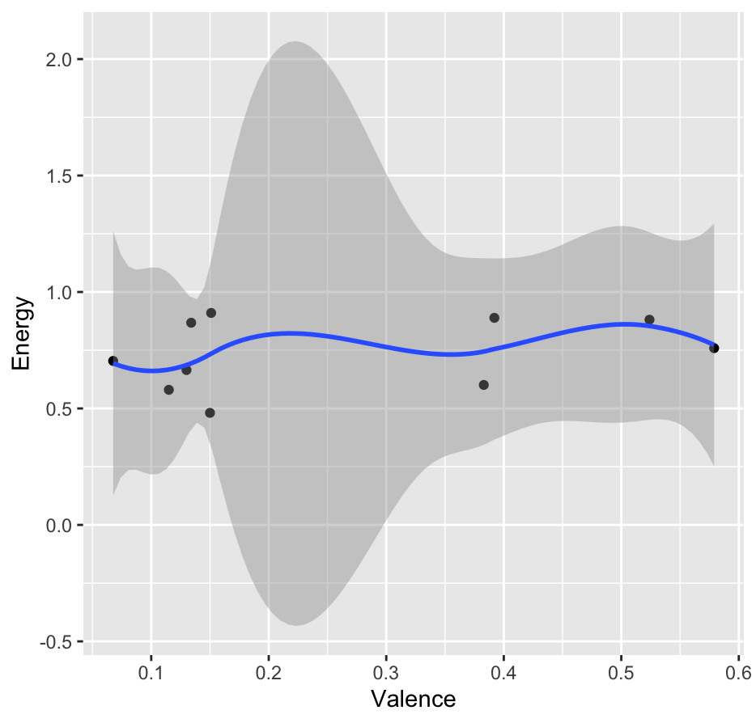

Description

The scatterplot compares two spotify track level features
within the Basspunk album, being energy and valence. Valence is measured
on the x-axis, with a numerical scale from 0.0 - 1.0. On this
scatterplot, the energy levels are measured on the y-axis, with a
numerical scale ranging from -0.5 - 2.5. Lower levels of valence
represent a more negative sound, in comparison to higher valence, which
represents tracks that sound more positive.

Interpretation 

The scatterplot demonstrates that the album adheres to a
particular tone, with valence clustering around 0.05 - 0.15 most
dominantly, but range to 0.56. The energy level in correlation to the
valence is at the values 0.5 -1.0, however the energy levels extend
beyond that range on their own, from -0.54 - 2.2.

Analysis 

The scatterplot demonstrates valence clustering around 0.05 -
0.15 most dominantly, and thus establishing the sound as more negative
and sad. As the valence values are tightly clustered, this scatterplot
demonstrates the album to have a strong stylistic cohesion overall,
however the first cluster contains 5 data points, whereas the second
cluster, ranging from 0.37- 0.56 values, suggests that there is actually
a broad range, and that there is already strong hybridization in terms
of the artists sound.

Evaluation 

The scatterplot helps to specifically visualise the overall
valence and energy of the album and the possible trends the datapoints
suggest in terms of where they cluster and at which corresponding data
value, which also establishes the scatter plot as a helpful tool in
musical comparison. The advantages of analysing the entire album through
this scatterplot also allows for a general overview of information,
however a strong limitation is that there was no exploration into
multiple scatterplots of different tracks from the same album. For
future research, exploration into more tracks from the corpus would also
be greatly beneficial.

Joy Division - Unknown Pleasures (1979)

Unknown Pleasures Histogram

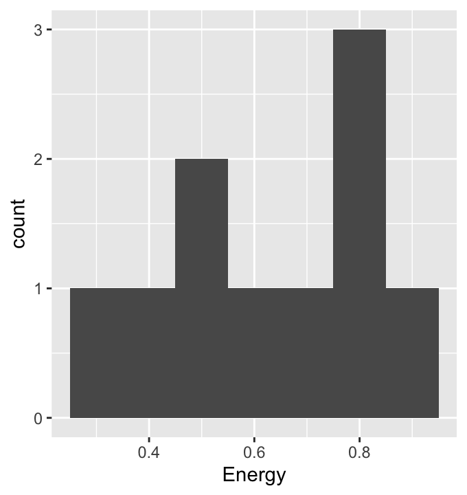

Description

The histogram demonstrates the Spotify audio features
energy and count for the Unknown Pleasures tracks by Joy Division in
1979. On the x-axis, the energy represents how fast, loud and noisy the
track feels, with values ranging from 0.0 -1.0, with higher values
indicating more energy produced. The y-axis represents the count,
ranging from 0-3 on this diagram, and indicates the frequency of a
specific energy value occurring. As stated above, the taller the
measure, the more time the song spends at that specific energy level.

Interpretation 

The histogram shows that the energy level 0.75-0.85 was
most consistently produced throughout the album, with 3 being the
highest counted measure, positing this energy level as the highest
measured frequency value spent throughout the album.

Analysis 

The histogram of Unknown Pleasures demonstrates a lower energy
level and count measure overall in comparison to that of Basspunk. The
lower energy and count levels are indicative of the typical post punk
genre conventions.

Evaluation 

As stated above, the histogram helps to specifically
visualise the energy level and the frequency at which it is measured,
making it a helpful tool in musical comparison. The advantages of
analysing the entire album’s recorded energy levels through this
histogram allows for a general overview of information, however a strong
limitation is that there was no exploration into multiple histograms of
different songs from the same album. For a stronger analysis, more
tracks would need to be produced and analysed in future research.

Unknown Pleasures Scatterplot

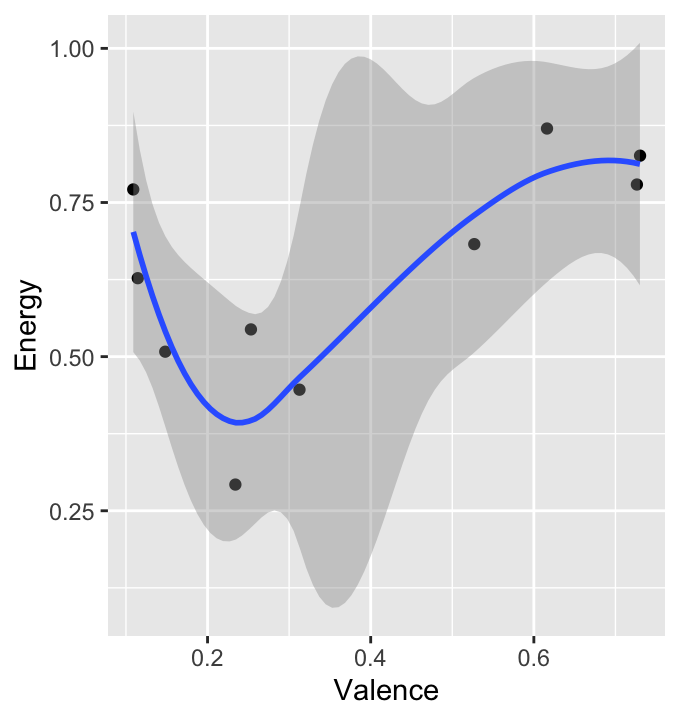

Description

The scatterplot compares two spotify track level features
within the Unknown Pleasures album, being energy and valence. Valence is
measured on the x-axis, with a numerical scale from 0.0 - 1.0. On this
scatterplot, the energy levels are measured on the y-axis, with a
numerical scale ranging from 0.0 - 1.0.

Interpretation 

The scatterplot demonstrates that the album’s valence
clustered around 0.0 - 0.32 most dominantly, but ranged to 0.73. The
energy level in correlation to the valence ranges from the values 0.10 -
1.0.

Analysis 

The scatterplot demonstrates valence clustering around 0.0 -
0.32 most dominantly, and thus establishing the sound as moderately
negative in tone, however has a higher clustered valence in comparison
to Basspunk, meaning Unknown Pleasures tends to stick to a relatively
contained stylistic tone, with slight variation. The energy levels are
also smaller in value in comparison to Basspunk, indicating a less
diverse range of genre exploration, but a stronger artistic cohesion
overall. The album was produced in a much earlier context in comparison
to Basspunk, thus the still relatively high energy levels indicate the
experimental nature of the post punk wave that Joy Division helped
pioneer.

Evaluation 

The scatterplot helps to specifically visualise the overall
valence and energy of the album and the possible trends the datapoints
suggest in terms of where they cluster and at which corresponding data
value, which also establishes the scatter plot as a helpful tool in
musical comparison. The advantages of analysing the entire album through
this scatterplot also allows for a general overview of information,
however a strong limitation is that there was no exploration into
multiple scatterplots of different tracks from the same album. For
future research, exploration into more tracks from the corpus would also
be greatly beneficial.

Bassvictim / Joy Division Combined Scatterplot

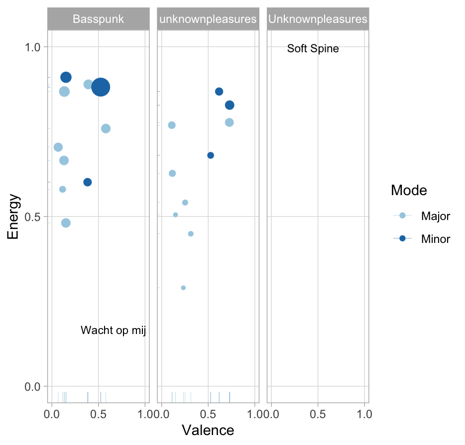

Description 

The Scatterplot demonstrates an overlay of both Basspunk and
Unknown Pleasures with energy levels on the y-axis ranging from the
numerical values 0.0 - 1.0, and valence on the x-axis with numerical
values ranging from 0.0 - 1.0.

Interpretation 

The Basspunk data points demonstrate higher a denser
cluster of data points clustered around 0.5 in terms of valence, whereas
the majority of Basspunk’s data points are clustered within the 0.0 -
0.5 valence numerical range, and higher levels of energy overall in
comparison to Unknown Pleasures, which has a broader range of data
points clustered within the valence range of 0.0 - 0.70, and more
frequent data points that obtain a lower energetic value.

Analysis 

The comparison of data points clustered indicates the
divulgence in genre adhesion, where Basspunk demonstrates higher energy
levels but a smaller valence range, and Unknown Pleasures has a wider
valence range, but lower energy levels overall. The similarities between
the two albums suggests they both align partially with post punk genre
norms, but the tonal range is wider for Joy Division, and the energy
levels are higher in Bassvictim.

Evaluation 

Based on the histograms and scatterplots, it is still
difficult to make distinctions in terms of how the two bands adhere to
the post punk genre conventions, as more information is needed to fully
explore this relationship and to draw a conclusion with more specific
insight into specific tracks from each album.

Week 8 - Chroma Features

Bassvictim - Flop, Basspunk (2024): Chromagram 


Description 

The chromagram visualises 12 pitch classes over time, with the brightest horizontal bands showing which notes are most active and suggest harmony and key. 

Interpretation 

The most dominantly bright rows on the chromagram analysis of the song Flop from the album Basspunk by Bassvictim, demonstrates the pitch classes A, C, E and some G and D clusters. 

Analysis 

The strongest clusters are around A minor and C Major as a pitch collection, with a frequent A,C,E combination. A minor appears to be the tonal center of the song, but with modal and diatonic variation. The chroma features indicate shifts in intensity, which reflect chord changes and transitions from different sections of the song, such as the verse and chorus. Overall, the structure seems to deviate over time, with multiple layers of audio and the core notes range from A,C,E and the key is most likely in A minor. 

Evaluation 

Despite the visually aesthetic appeal of the chromagram, and its ability to map chroma features, the chromagram is limited as it is not always able to separate harmonic content in the audio signal very well, making it more difficult to filter through musical information, and the integrity of results less reliable. For future research, more tracks could have been analysed for a broader scope of retrieved information within the selected corpus, as one song only offers so much knowledge about the broader patterns that Bassvictim might use. 
To better answer the research question, more information would be beneficial by producing more chromagrams of a wider range in track selection. 


Joy Division - Disorder, Unknown Pleasures (1979): Chromagram 

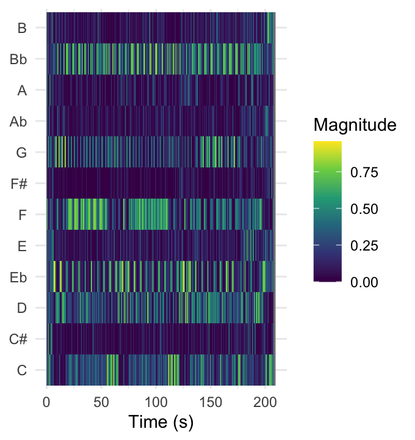

Description 

The chroma pitch classes display the distribution of pitch class energy over time for the song Disorder, from the album Unknown Pleasures by Joy Division. 

Interpretation 

There is a strong persistent energy in Bb, F, D and Eb, suggesting a tonal center around Bb major. 

Analysis 

The repeated emphasis on Bb, D and F implies that Bb is the major triadic structure, and the presence of Eb supports diatonic harmony within that key.

Evaluation 

This chromagram effectively highlights pitch class prominence, however it does not capture octave detail. Furthermore, the chromagram is limited as it is not always able to separate harmonic content within the audio signal very well, making it more difficult to filter through musical information, and the integrity of results less reliable. For future research, more tracks could have been analysed for a broader scope of retrieved information within the selected corpus, as one song only offers so much knowledge about the broader patterns that Joy Division might use. To better answer the research question, more information would be beneficial by producing more chromagrams of a wider range in track selection. 


Disorder / Flop - Comparative Chromagram

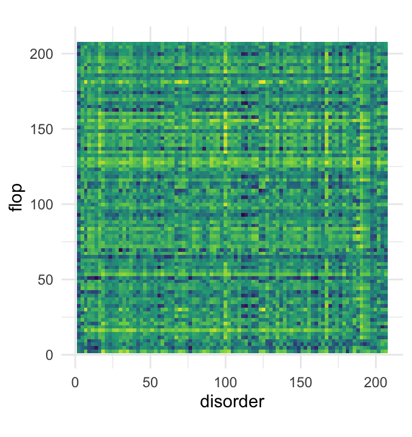

Description 

The chromagram above is a cross similarity matrix between the songs Flop by Bassvictim and Disorder by Joy Division, the x-axis shows the data recorded from the song Disorder, and the y-axis shows data from the song Flop. Each axis represents the progression of chroma values, showing energy distribution across the 12 pitch classes, for each song over time. The colors demonstrate the degree of similarity between the frames, with the brighter yellow regions indicating higher similarity between corresponding time blocks, and the darker blue regions indicating less similar pitch class profiles. 

Interpretation

The chromagram shows an absence of clear and long continuous diagonal lines, suggesting a limited large-scale harmonic correspondence between the two tracks. The fine grained patchwork of similarity points indicates that there is a local coincidence in harmonic regions, without any extended structural alignment. 

Analysis 

The alternating bands and textures reflect a chordal motif between the two songs, occurring at different times. The repeated horizontal streaks, around the pitch frames 50, 100 and 150, might suggest recurring harmonic material. Furthermore, the chromagram is sensitive to key transpositions, and the lack of strong diagonal alignment implies the key differs between the two songs. 

Evaluation 

This chromagram reflects that the two songs share some local harmonic affinities, but overall they diverge in tonal trajectory and structure. The chromagram illustrates that the two songs belong to a similar genre due to harmonic similarity, however they differ in form and melody, making them distinctly different from one another. For future analysis, a comparison using dynamic time warping would help identify the harmonic parallels that exist between the two songs in time and key. 

:::

### Chapter II.

::: {style="display: flex; gap: 20px;"}
Week 9: Structure Analysis - Self Similarity Matrices

Comparative Chromagram and Timbre Analysis (with MFCC Features)

Bassvictim - Flop, Basspunk (2024)

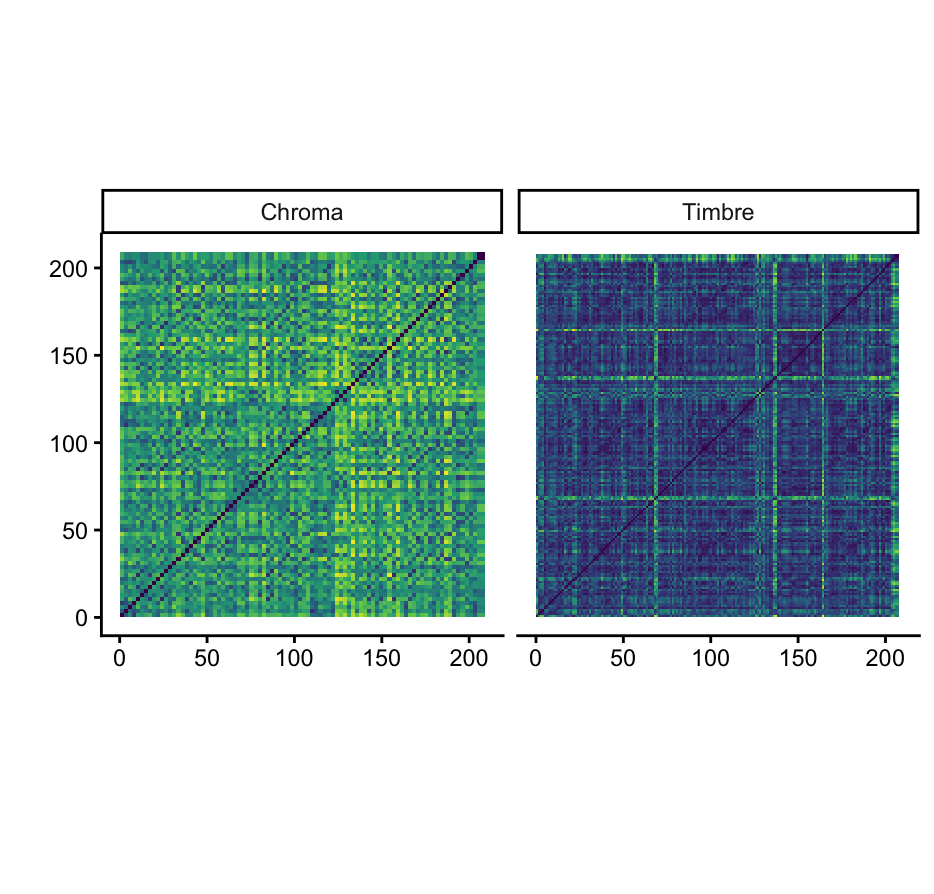

Joy Division - Disorder, Unknown Pleasures (1979)

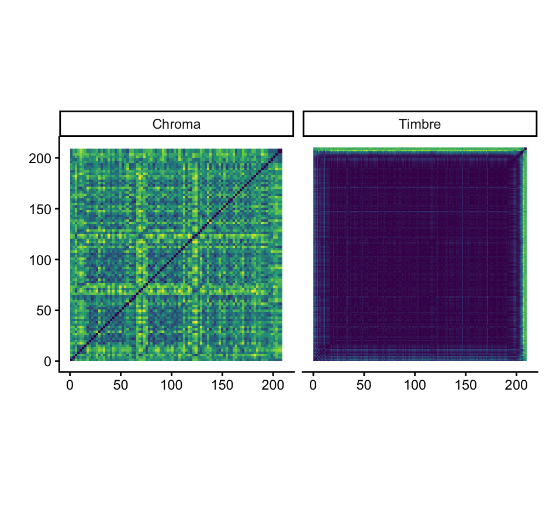

Cepstrograms

Bassvictim - Flop, Basspunk (2024)

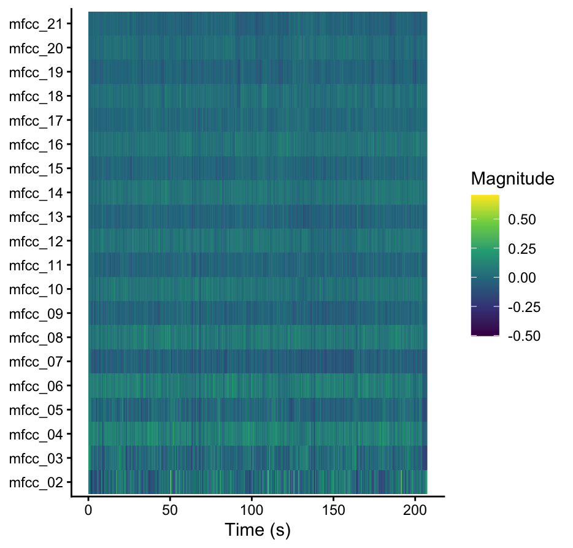

Joy Division - Disorder, Unknown Pleasures (1979)

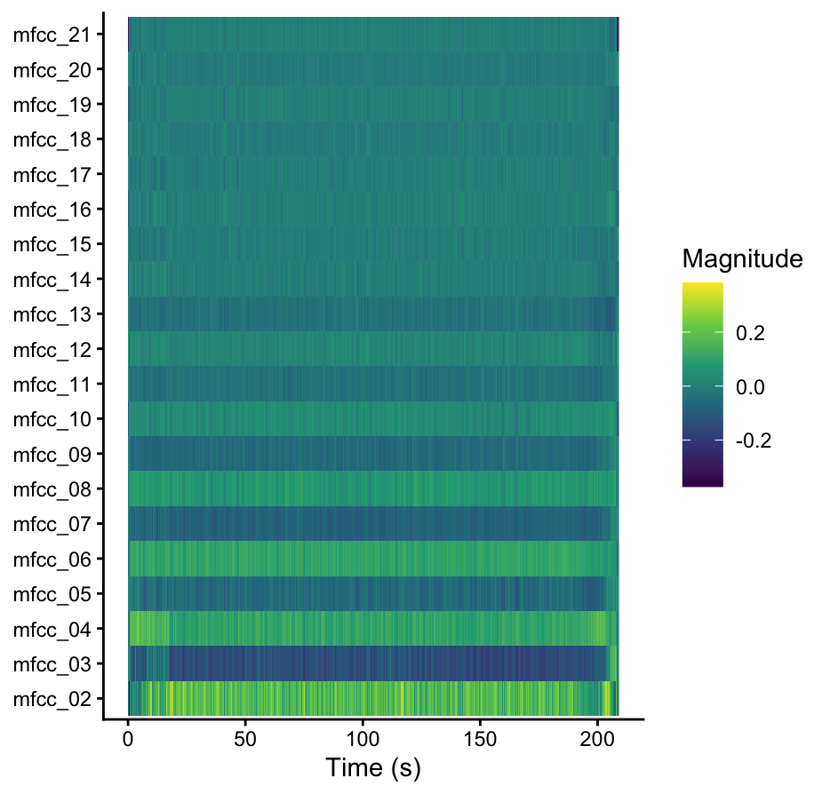

Self Similarity Matrices - Timbre

Bassvictim - Flop, Basspunk (2024)


Joy Division - Disorder, Unknown Pleasures (1979)

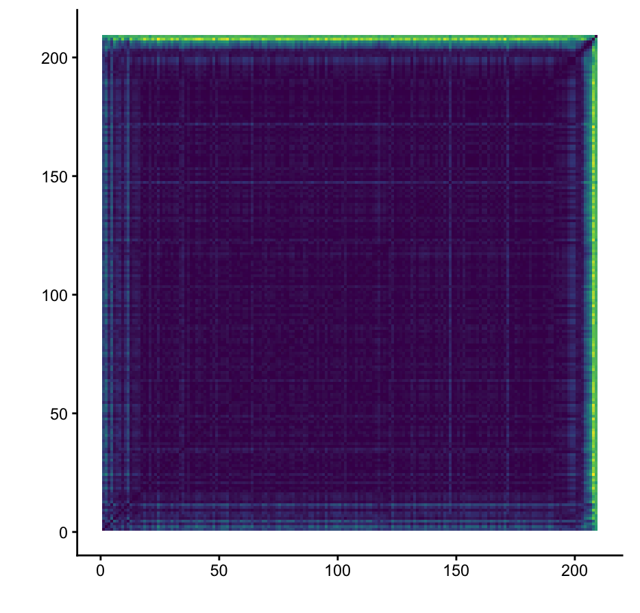

Description

The collection of visualisations depicts a comparative and feature-based exploration of two musical tracks using spectral and temporal descriptors. The first composite image contrasts self-similarity matrices for Chroma (pitch-class features) and Timbre (spectral envelope characteristics). Both matrices are square, measuring approximately 220×220 frames, implying a shared temporal resolution. The Chroma matrix displays a pronounced diagonal line from the top-left to the bottom-right, indicating high similarity of each frame to itself, and a complex grid-like texture of green and yellow bands, reflecting patterns of repeated harmonic content. In contrast, the Timbre matrix appears darker overall, suggesting generally lower pairwise similarity, with only faint structural traces near the edges.
The next pair of visualisations presents MFCC (Mel-Frequency Cepstral Coefficient) features for each song over time, showing coefficients mfcc_02 through mfcc_21 along the vertical axis and time in seconds along the horizontal. The first song’s MFCC heatmap shows consistent horizontal banding with moderate contrast, while the second song exhibits more pronounced low-order coefficients (particularly mfcc_02–mfcc_06), possibly reflecting brighter timbral content or more stable spectral energy distribution. The final two self-similarity matrices visualize within-song similarity for both the chroma and timbre domains. The chroma self-similarity pattern again shows structured, block-like organization, while the timbre matrix remains relatively uniform and low-contrast, signaling fewer timbral recurrences.

Interpretation

The Chroma-based matrices and MFCC plots reflect primarily harmonic and timbre-related dimensions of musical similarity, respectively. The strong diagonal and recurring grid patterns in the Chroma matrix suggest that both songs share periods of harmonic repetition or patterned chord progressions, potentially verse chorus structures or recurring tonal centers. The Timbre matrix’s uniform darkness implies that the spectral envelope changes more consistently throughout the piece, with fewer instances of self-similar timbral sections.
In comparing the MFCC plots, differences in low-order coefficients, those representing global spectral shape imply that Disorder maintains a more consistent and darker timbre, while the Flop features brighter, more dynamically varying texture. The persistence of mid-range coefficient energy across both songs suggests some shared spectral distribution patterns, likely due to similar instrumentation or production style. When compared across feature domains, the Chroma representations capture clear structural-harmonic cyclicity, whereas the Timbre and MFCCs convey smoother temporal evolution, hinting at stylistic contrast in tone rather than in pitch or harmony.

Analysis

Quantitatively, the Chroma matrices indicate moderate to strong internal repetition, evidenced by the frequent bright squares off the main diagonal. These may correspond to repetitions of harmonic progressions or cadential patterns across sections. In contrast, the Timbre matrices display weak internal self-similarity, with spectral shapes evolving gradually over time, and are consistent with changing instrumental layers, effects, or dynamic processing typical in many studio recordings.
In the MFCC domain, the first song’s nearly uniform magnitude distribution across coefficients suggests a relatively homogeneous spectral environment. Flop has a stronger definition in lower-numbered coefficients (mfcc_02–mfcc_06) and might reflect timbral brightness and distinct attacks. Together, these results indicate that while both songs operate within compatible harmonic frameworks, their timbral articulation diverges significantly, with Disorder being smoother and tonally centered, and Flop being more texturally foregrounded.

Evaluation

From a computational musicology standpoint, the combination of these visuals offers a multidimensional comparison between the songs’ harmonic and timbral structures. The Chroma features highlight clear harmonic cycles and recurrent tonal relationships, indicative of form, while the Timbre and MFCC analyses reveal subtler shifts in spectral texture and instrumentation. The contrast between the highly structured Chroma self-similarity and the diffuse Timbre matrix demonstrates that harmonic stability and timbral evolution operate independently in these recordings, a finding consistent with many modern pop or electronic productions where harmony repeats but the sound palette evolves continuously over time.
Altogether, these visualizations provide a layered understanding of musical similarity, the pieces share broad harmonic language but differ in timbre and production texture, illustrating how computational features can disentangle structure, tone, and texture within the same musical timeframe. These differences underscore the analytical power of combining chroma-based harmonic representations with timbral descriptors like MFCCs when evaluating cross-song relationships in digital musicology. To provide an even stronger analysis in the future, a wider selection of tracks would help offer more insight into the relationship between the two artists and their respective albums. 

:::

### Chapter III.

Week 10: Chord Estimation - Chordograms

Comparative Harmonic and Timbre Analysis: Basspunk (2024) vs Unknown Pleasures (1979)

1.  Bassvictim - Flop, Basspunk (2024)

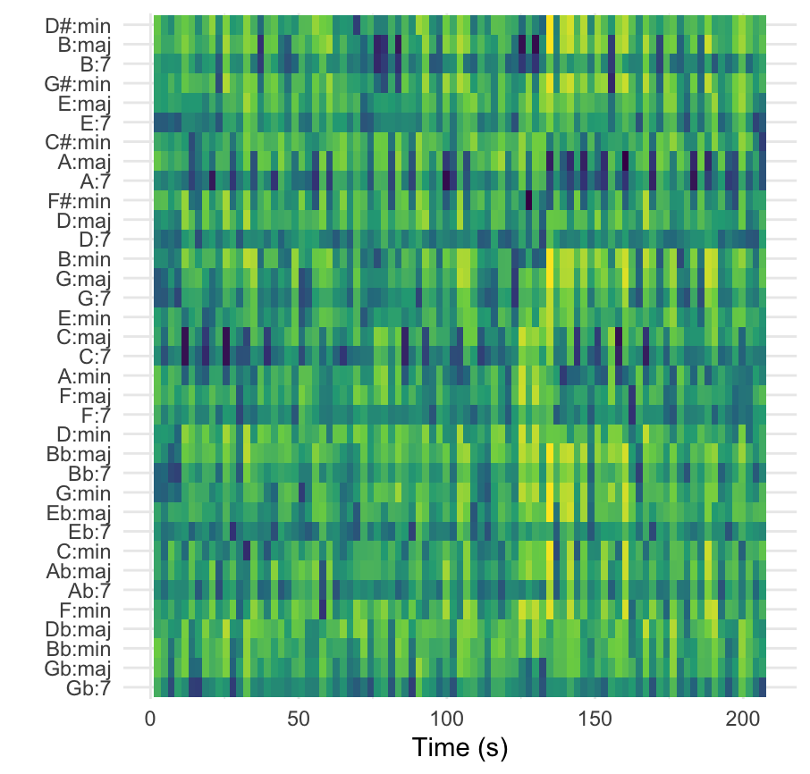

2.  Joy Division - Disorder, Unknown Pleasures (1979)

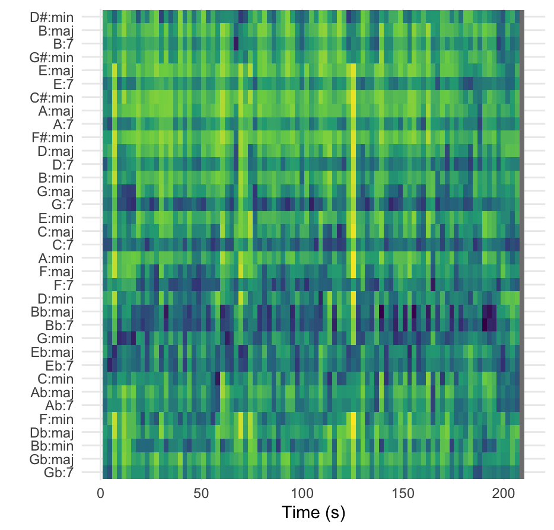


Description

The harmonic representations presented here show chordal analyses over time for two works: Basspunk (2024) by Bassvictim and Unknown Pleasures (1979) by Joy Division. Both visualisations display time (in seconds) on the x-axis and deduced chord labels on the y-axis, mapping tonal and harmonic movement throughout each song. The color scale represents activation intensity, where brighter yellows indicate stronger chord occurrences and darker areas mark low activation or harmonic ambiguity.
Across both spectra, chords span major, minor and seventh categories, with some perceptible cyclic repetition of tonal material. The harmonic fields of both tracks appear densely saturated, suggesting frequent harmonic shifts or complex chordal layering. However, Basspunk exhibits greater overall brightness and uniform saturation, implying a more pronounced or dynamically changing harmonic field, while Unknown Pleasures demonstrates a tighter, more recurrent pattern structure, consistent with its minimalist post punk tonality and limited harmonic vocabulary.

Interpretation

These results highlight both continuity and divergence in each artist’s harmonic design. Joy Division’s Unknown Pleasures, situated within late-1970s post-punk, is known for its restrained harmonic palette, repetition, and modal ambiguity, which are hallmarks of tension and emotional minimalism that reinforced Ian Curtis’s lyrical introspection and Martin Hannett’s austere production techniques. Conversely, Bassvictim’s Basspunk demonstrates harmonic fluidity, with chords spanning a wide tonal range (from major to dominant 7th and minor variations), mirroring the exploratory nature of electro-pop and hybrid EDM genres.
This broader distribution of tonal areas and chords with higher chromatic density implies that Basspunk takes the post-punk harmonic language as a foundation, yet reinterprets it through electronic modulation and bright timbral articulation. By contrast, Unknown Pleasures retains a darker, monotone harmonic center, where repetition and sonic sparseness act as expressive tools.

Analysis

The harmonic comparison reveals critical differences in compositional mechanics. Unknown Pleasures often sustains its emotional drive through static harmony and hypnotic rhythmic cycles, evident in the limited vertical movement of dominant chords and minor intervals, a technique that creates the cold, detached atmosphere characteristic of post-punk aesthetics. This aligns with Martin Hannett’s production emphasis on space, decay, and bass clarity, allowing Peter Hook’s melodic basslines to function quasi-harmonically against Bernard Sumner’s sparse guitar figures.
In contrast, Basspunk’s harmonic heatmap shows more uniform intensity across all chord categories, implying heavier harmonic saturation and a compressed dynamic range. These dense harmonic transitions could result from layered synthesizers or timbre-focused production, prioritizing texture over structural economy. The presence of abundant 7th and extended chords, combined with close chromatic proximity, supports the interpretation that Basspunk engages post-punk influences through harmonic coloration rather than tonal restraint.
When cross-referenced with MFCC and timbre-based matrices (from the previous comparative set), Basspunk displayed smoother timbral transitions but higher overall brightness, consistent with a digital or synthesized sound palette. Unknown Pleasures, meanwhile, exhibited higher spectral variance, reflecting organic instrument decay and analog production. Thus, the two albums share structural periodicity but diverge in harmonic and textural density: where Joy Division leaves room for tension, Bassvictim contributes saturation.

Evaluation

In addressing the research question, the observed computational features suggest that while Basspunk aligns partially with the post-punk lineage of Unknown Pleasures, it simultaneously extends and hybridizes the genre boundaries. Harmonic recurrence and low-key tonal centers echo Joy Division’s influence, maintaining a sense of tension and minimalist tonality. However, the increased harmonic saturation and timbral brightness of Basspunk mark a distinct evolution from post-punk’s austerity toward a more hypermodern electro-post-punk hybrid.
Joy Division’s minimalist harmonic motion and spectral sparseness produce affective distance, an emotional hallmark of post-punk aesthetics shaped by bleak industrial modernism of late-1970s Manchester. Bassvictim transforms this into a digital maximalist reinterpretation, amplifying rhythm and harmonic surface area while preserving emotional intensity through production saturation rather than melodic economy. This reflects a genre continuum rather than a strict stylistic alignment: Basspunk does not reject post-punk traits but reconfigures them through the lens of hyperpop and EDM’s immediacy.
In conclusion, both computational and musical evidence support the provisional hypothesis, Basspunk demonstrates measurable harmonic and timbral divergence from Unknown Pleasures. Rather than replicating post-punk’s minimal emotional geometry, it metabolizes its dark atmosphere into a densely hybridized, high-energy sound world, confirming that Bassvictim’s corpus aligns conceptually but not formally with Joy Division’s genre-defining aesthetic. The model’s results hence reveal a contemporary recontextualization of post-punk within modern production paradigms, emblematic of evolving genre fluidity in 2020s alternative music.


### Chapter IIII.

::: {style="display: flex; gap: 20px;"}
Week 11: Novelty Functions and Tempograms

Temporal and Rhythmic Structure Comparison: Basspunk (2024) vs Unknown Pleasures (1979)


Bassvictim - Flop, Basspunk (2024)

Novelty Function Tempogram I.


Tempogram II.


Tempogram III.


Novelty Function Tempogram - Joy Division - Disorder, Unknown Pleasures
(1979)

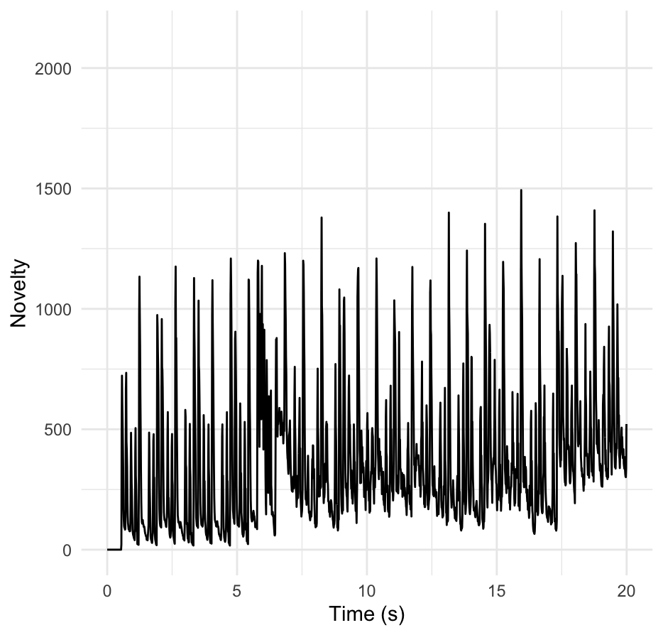

Description

The visualisations above explore temporal and rhythmic dimensions across both recordings. The first and last plots depict novelty functions, showing peaks in onset energy that correspond to rhythmic or structural changes,  moments in the track where something new happens in the sound. The second and third graphs show tempograms, illustrating fluctuations in beats per minute (BPM) relative to time.
In Basspunk, the novelty curve shows sharp, isolated spikes early in the track and again around the 20-second mark, surrounded by long stretches of relative quiet. This signals big, clear moments of contrast, possibly sudden drops, rhythmic resets, or textural bursts that stand out dramatically. By contrast, Unknown Pleasures shows a dense forest of peaks; almost continuous rhythmic novelty, though less extreme in amplitude. The corresponding tempogram for Basspunk spans a wide BPM range, oscillating between 100–400 BPM zones, while Unknown Pleasures stays closer to consistent rhythmic rates, clustering around lower BPM values indicative of the band’s tight but driving pace.

Interpretation

These rhythmic profiles tell a story about artistic evolution. Joy Division’s music often locks into minimal, mechanical grooves, where the drum patterns of Unknown Pleasures resemble steady post punk motion, emotionally intense yet rhythmically rigid. The tight cluster of tempo activity reflects that, relatively stable BPM throughout, with few dramatic deviations. That rhythmic constancy was part of what made their sound haunting, a hypnotic pulse mirroring urban alienation.
Basspunk, however, looks entirely different under the same microscope. The rhythmic space is fragmented, jumpy, and dynamic. Those isolated novelty spikes at the start and again later suggest deliberate rhythmic reinvention, drops, glitchy transitions, or hybrid EDM inspired section changes. While Joy Division built intensity through repetition, Bassvictim built it through rupture. The higher BPM activity distributed across time points toward digital beat manipulation typical of modern production,  possibly side-chained rhythms or hyperpop-level tempo modulations, trading the stability of post-punk for something more kinetic and elastic.

Analysis

Looking closely, Unknown Pleasures’ novelty function suggests continuous micro-textural evolution, with consistent rhythmic engagement and minimal silence. This visual density can be linked to the mechanical regularity often discussed in post-punk discourse, where rhythm sections (Stephen Morris’s drumming, Peter Hook’s basslines) maintain a hypnotic drive. The track’s tempo coherence in the 100–160 BPM range exemplifies high-energy tension without the volatility seen in later genres.
Basspunk, in contrast, shows both wide tempo variance and localized rhythmic bursts. This reflects multi-layered production typical of EDM-influenced genres, rapid alternation between rhythmic density and ambient dropouts. The tempogram heatmap shows density zones both around 120 BPM (a common dance metric) and near 300–400 BPM artefacts, possibly indicating double-time or breakbeat elements folded into the mix. The contrast between near-silence and explosive rhythmic change reinforces a deliberate manipulation of listener expectation. Seen computationally, these rhythmic fingerprints present Bassvictim’s sound as globally hybrid, the foundational pulse of post-punk persists, but its rhythmic expression has been warped, atomized, and reassembled through digital design.

Evaluation

Taken together, the rhythmic data strengthens the argument that Basspunk both inherits and reimagines the rhythmic logic of Joy Division’s Unknown Pleasures. The older album’s structure emphasizes hypnotic constancy, every beat grounded, each groove a slow crawl through intensity. Bassvictim, on the other hand, mirrors that focus on rhythm but flips the mode of engagement: tension is built not through repetition, but through rupture and excess. Novelty spikes and high-BPM passages signify not mechanical drive but digital overstimulation, an aesthetic choice that feels both indebted to and reactionary against post-punk’s mood.
Ultimately, Bassvictim’s rhythmic form represents a post-post-punk evolution, retaining the genre’s emotional edge and intensity but channeling it through glitch, digital syncopation, and micro-temporal disruption. 


:::

### Chapter V.

::: {style="display: flex; gap: 20px;"}
Week 12: Hierarchical Clustering

Cluster and Feature Analysis: Basspunk (2024) vs Unknown Pleasures (1979)

Bassvictim, Basspunk (2024)

Bassvictim Dendogram


Bassvictim Heatmap


Joy Division, Unknown Pleasures (1979)

Joy Division Dendogram

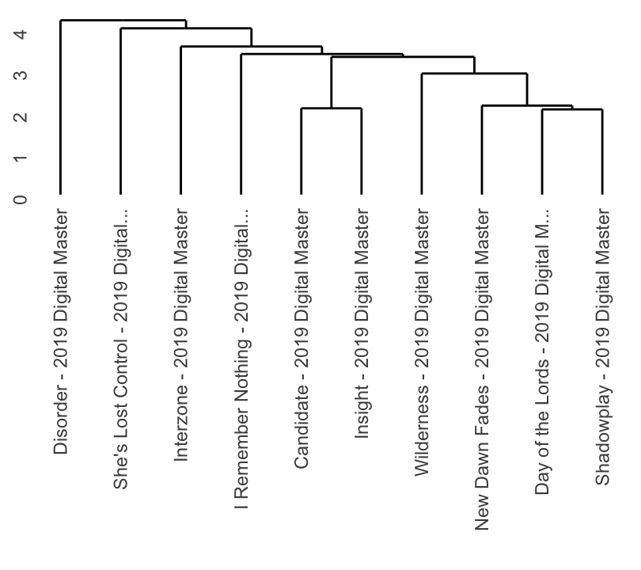

Joy Division Heatmap

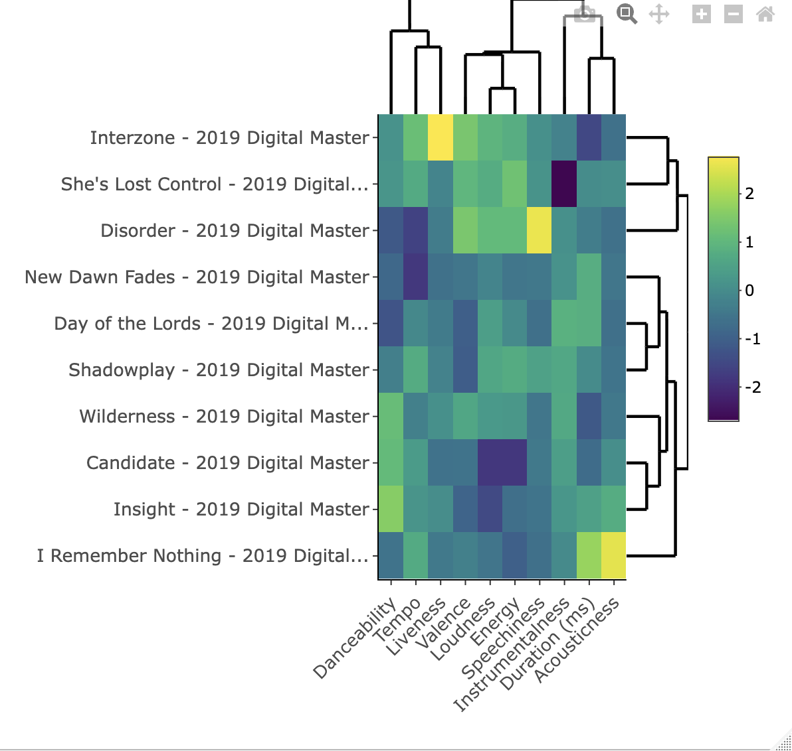

Description

These final visualisations present hierarchical cluster analyses and clustered heatmaps using Spotify’s feature set, including attributes like danceability, energy, acousticness, loudness, valence, instrumentalness, and tempo. The dendrograms show how tracks group together based on overall similarity across these features, while the heatmaps visualize the relative intensity of each feature value.
For Basspunk, the dendrogram (top left) reveals three broad clusters. One combines “L-ON-D-ON,” “Vacation,” and “As Long As,” another groups “I Like It,” “Flop,” and “Air on a G String,” while “Canary Wharf Drift” and “Welcome” stand slightly apart, forming peripheral clusters. The accompanying heatmap shows variation across energy, tempo, and instrumentalness, with certain tracks (“L-ON-D-ON rmx,” “Welcome”) showing higher loudness and energy, and others (“Vacation,” “As Long As”) leaning towards reduced valence and greater acoustic or speech characteristics.
By contrast, the dendrogram and heatmap for Unknown Pleasures indicate much tighter internal cohesion. Joy Division’s tracks, including “Disorder,” “She’s Lost Control,” and “Day of the Lords,” sit close together, with only minor variation, suggesting consistency in energy, loudness, and tempo across the album. The heatmap supports this visually, energy and loudness levels remain relatively stable, while features like instrumentalness, valence, and liveness show low variance, reflecting the aesthetic uniformity of Joy Division’s production.

Interpretation

These clustering patterns highlight essential stylistic differences between the two albums. Unknown Pleasures forms a compact genre cluster, its songs are sonically consistent, tightly bound by post-punk conventions, cold production, low acousticness, low valence, moderate tempo, and high energy density. This stability reinforces the band’s identity and the emotional coherence of the album’s bleak tone.
Basspunk, however, demonstrates a fragmented internal structure, suggesting experimentation across its tracks. The spread of feature clusters, and the broader color variation across its heatmap, implies an album built on contrast. Bassvictim alternates between high-intensity electronic energy (“L-ON-D-ON rmx,” “Welcome”), minimalist or atmospheric cuts (“Canary Wharf Drift”), and genre-blending hybrids that fuse EDM, hyperpop, and alt-indie timbres. This variability reveals an intentional genre fluidity, consistent with the hypothesis that Bassvictim’s work doesn’t fit neatly into post-punk’s established sonic mold.

Analysis

The heatmaps and dendrograms confirm a quantitative difference in intra album cohesion. In Unknown Pleasures, features like energy, loudness, and instrumentalness align strongly across tracks, supporting the idea of a unified production ethos, Martin Hannett’s signature sparse mix and consistent EQ balance. The absence of major outliers in the cluster structure reflects how post-punk’s production norms centered more on atmosphere and repetition than on stylistic change from track to track.
Conversely, Basspunk’s cluster separations and mixed-feature intensities reflect multi-modal production,  some tracks favor danceability and tempo from EDM influence, others prioritize textural depth and instrumental focus, a postpunk residue. The branching structure of the dendrogram shows clear genre-crossing within the same record, pointing to varied compositional strategies. The timbral and rhythmic analyses earlier within this portfolio, demonstrate that Bassvictim’s sound uses electronic modulation and structural rupture as identity markers, whereas Joy Division’s cohesion stems from constraint and minimalism.

Evaluation

Ultimately, Basspunk (2024) clearly echoes the post-punk ethos of Unknown Pleasures through its persistent low valence, moderate-to-high energy, and bass-driven focus, but the clustering results underscore that Bassvictim’s album functions as a hybrid evolution of the genre rather than a reproduction. The loose formation of feature clusters, compared to Joy Division’s tightly bonded structure quantitatively visualizes this hybridisation.
In conclusion, Joy Division’s Unknown Pleasures represents genre definition, while Bassvictim’s Basspunk represents genre synthesis, the folding in electro-pop brightness, rhythmic volatility, and EDM’s production dynamism. The computational evidence, ranging from MFCC and chroma analyses to these final heatmap and clustering results, consistently points toward divergence in structural and timbral coherence.
While both albums share emotional tonality and rhythmic intensity, Basspunk transforms those foundations into an aesthetically expansive, post-digital interpretation of post-punk. This confirms the research hypothesis, that Spotify derived musical features do not show strict alignment between the two albums, and rather illustrate Bassvictim’s creative hybridisation, which can be considered an update to the post punk vocabulary for the hypermodern age.

:::

