

# Overview

The object of this study is [**bassvictim flop (2024)**](https://youtu.be/CyW3c4GXipQ?si=3PxxSZyenU0eu7rf). Several operations have been performed. In particular, two temporal features: *(1)* **a chromatic analysis**, in which pitch information was charted in time; *(2)* **a timbre analysis**, which charts mel-frequencies information in time. The other part covers temporal self-similarity by utilizing **self-similarity matrices** for *(3)* **chromatic** features, and *(4)* **timbre-based** features.

# flop

## Analysis Views {.tabset}

### Histogram (week 7)

 
  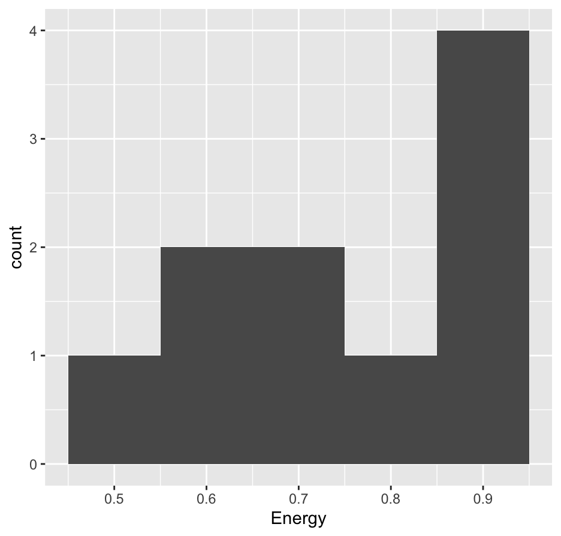 

(1) The Histogram above reflects the album 'Basspunk' (Bassvictim, 2024) and shows the highest count reached is 4 measures, at 0.95 normalized amplitude. 

### Chroma, Timbre (week 8)

 
  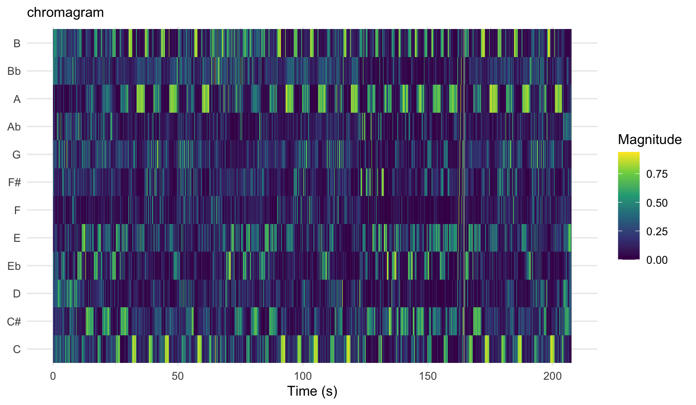 
  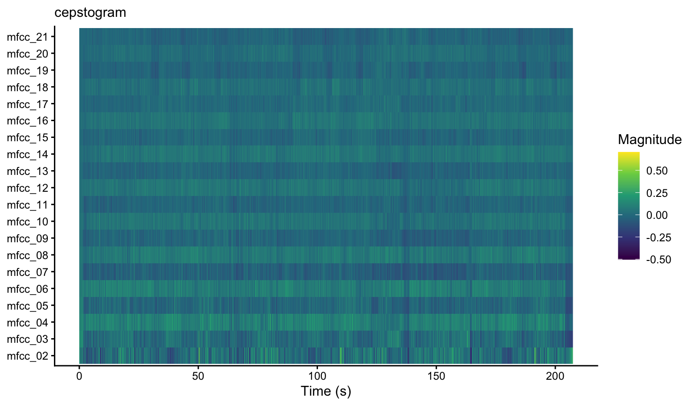 

### SSMs (week 9)

 
  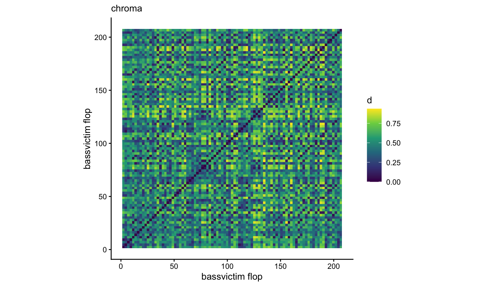 
  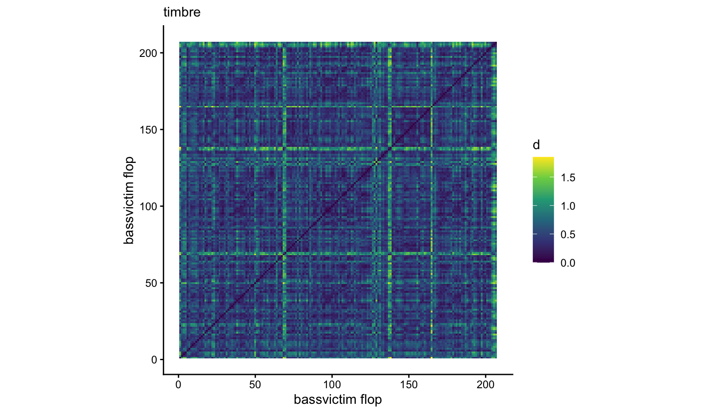 

(1) there is a strong diagional line indicating a correlation between the same song comparison which is great ! 
(2) the checkered lines also indicate that the songs information is showing a strong pattern

### Keys (week 10)

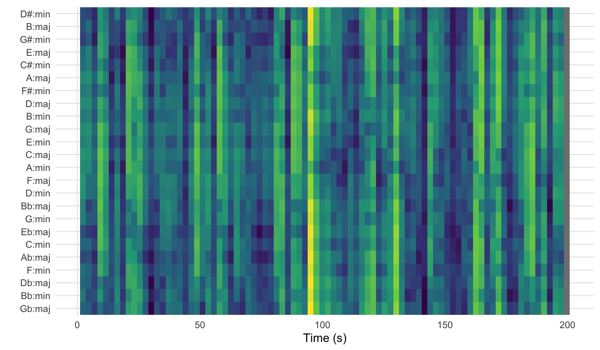 

(1) this keygram shows a concentration within the range of 90 -110 seconds, suggesting that at the point in the song the music was at its peak frequency 

### Tempo (week 11)

 
  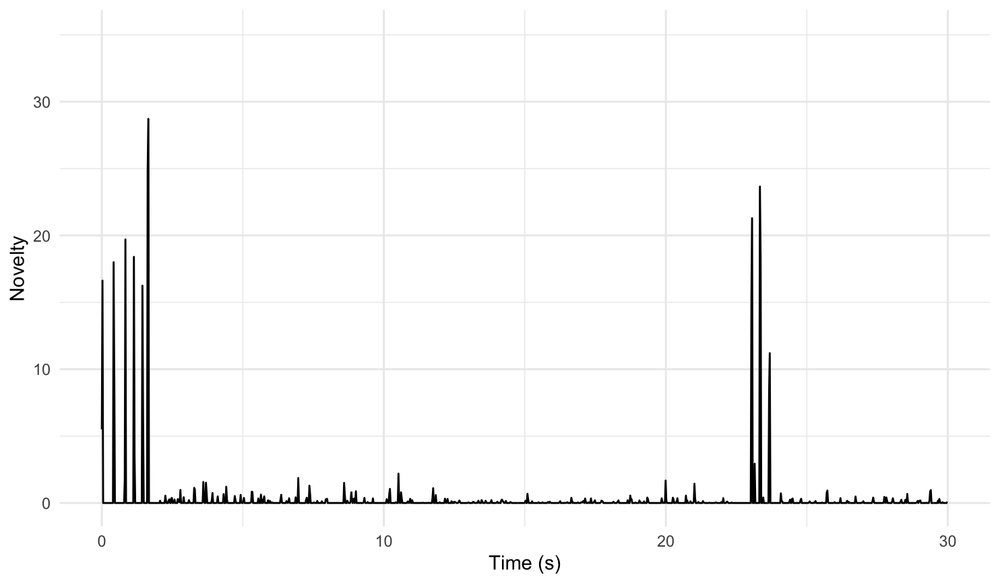 
  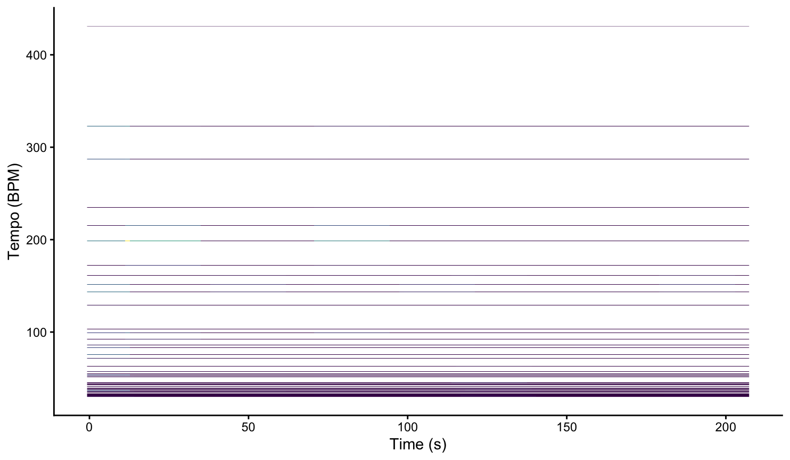 
  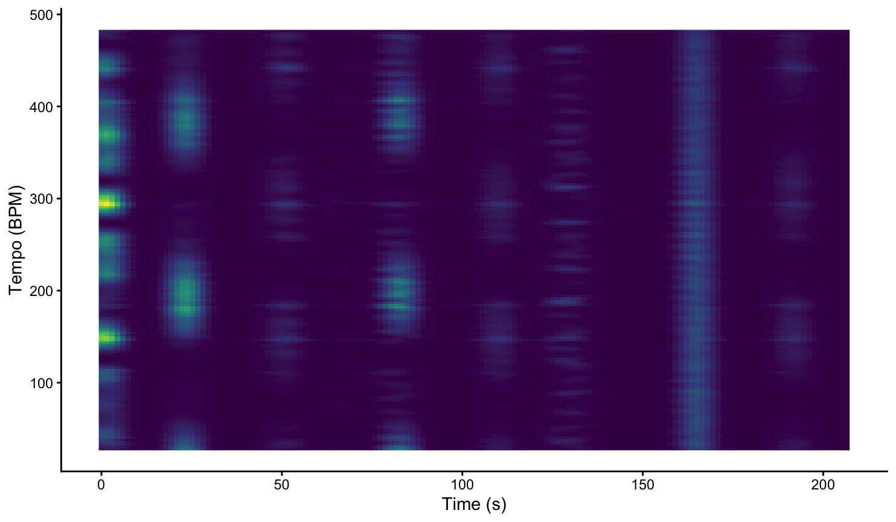

(1) graph 1 shows high transients in the begining of the song because it is the intro, and then there is also a spike later because of the chorus.

(2) graph 2 shows us that the BPM does not change and its because it is an electronic song, composed using a sequencer making it rythmically perfect. 

(3) graphi 3 tells us that the BPM was a multiple of 75 in the previous graph, 
and in this graph shows us that the real tempo is most likely 150 BPM, due to a dense visual concentration on the heat map in that range. 

### Hierarchical Clustering (week 12)

 
  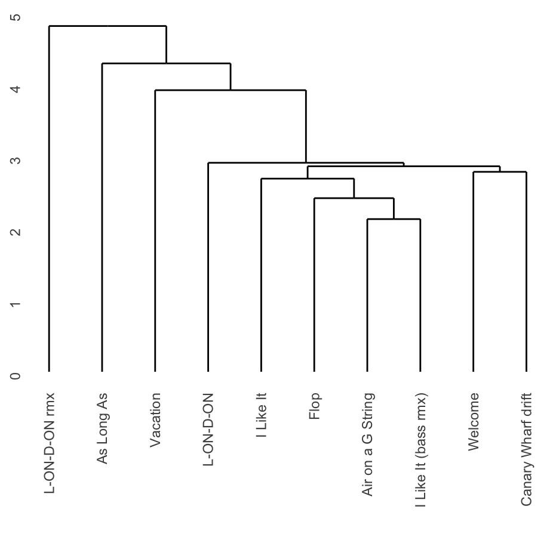 
  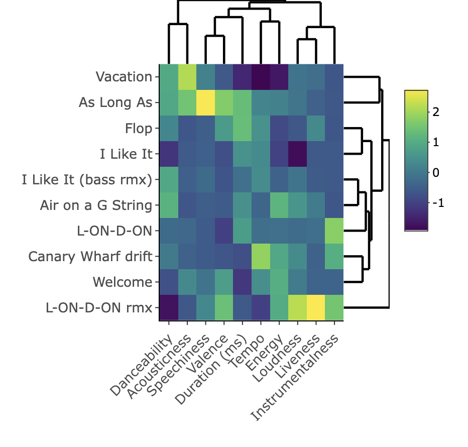 

(1) The Dendogram above shows that most tracks cluster around the core group, 'I Like it', 'Flop', and 'Air on a G string'. 
(2) The Heatmap above shows the features of the album Basspunk (Bassvictim, 2024) and reflects the song 'As Long As' clusters the highest degree of speechiness, and the song 'L-ON-D-ON rmx' has the highest degree of the liveness feature. 

